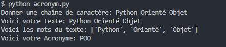
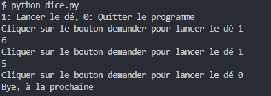
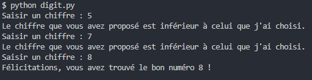
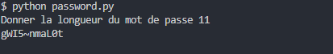
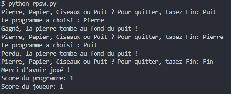

# :game_die: Excercices - Python

Ces excercices ont été réalisé dans le cadre d'une formation de <a href = 'https://www.udemy.com/course/apprendre-python-a-z/' target = '_blank'>UDEMY</a> afin d'apprendre les bases de Python.

## Comment Exécuter les Programmes Localement

1. Clonez ce référentiel sur votre machine locale :
   ```bash
   git clone https://github.com/votre-utilisateur/votre-repository.git
   ```
2. Accédez au dossier du projet :
   ```bash
   cd votre-repository
   ```
3. Utiliser alors la commande
   ```bash
   python nom_du_script.py
   ```
   pour lancer le programme souhaiter

### Contenues

- **Acronym :** Ce script génère un acronyme à partir d'une chaîne de caractères saisie par l'utilisateur.

Utilisation :

```bash
python acronym.py
```

L'utilisateur entre une phrase, et le script génère un acronyme en prenant la première lettre de chaque mot de la phrase.

- **Dice :** Ce script simule un jeu de dé où l'utilisateur peut lancer un dé virtuel en appuyant sur un bouton.

Utilisation :

```bash
python dice.py
```

L'utilisateur peut saisir 1 pour lancer le dé ou 0 pour quitter le jeu. Le script affichera un nombre aléatoire entre 1 et 6 à chaque lancer.

- **Digit :** Dans ce jeu, l'utilisateur doit deviner un chiffre aléatoire entre 0 et 9 en trois tentatives.

Utilisation :

```bash
python digit.py
```

L'utilisateur a trois tentatives pour deviner le chiffre généré par le programme. Le script fournit des indices si le chiffre deviné est trop haut ou trop bas.

- **Password :** Ce script génère un mot de passe aléatoire de longueur spécifiée par l'utilisateur en utilisant une combinaison de lettres, chiffres et symboles spéciaux.

Utilisation :

```bash
python password.py
```

L'utilisateur est invité à saisir la longueur du mot de passe souhaité, et le script génère et affiche un mot de passe aléatoire.

- **RPSW :** Ce jeu est une extension du jeu classique "Pierre-Papier-Ciseaux", incluant une quatrième option : le puit.

Utilisation :

```bash
python rpsw.py
```

L'utilisateur choisit entre "Pierre", "Papier", "Ciseaux" ou "Puit". Le programme génère un choix aléatoire et détermine le gagnant en fonction des règles du jeu.

### Technologie Utilisée


### Connaissance

Ces mini-projets m'ont permis de revoir les conditions, les boucles, les variables, ainsi que la découverte du f-string en Python.






